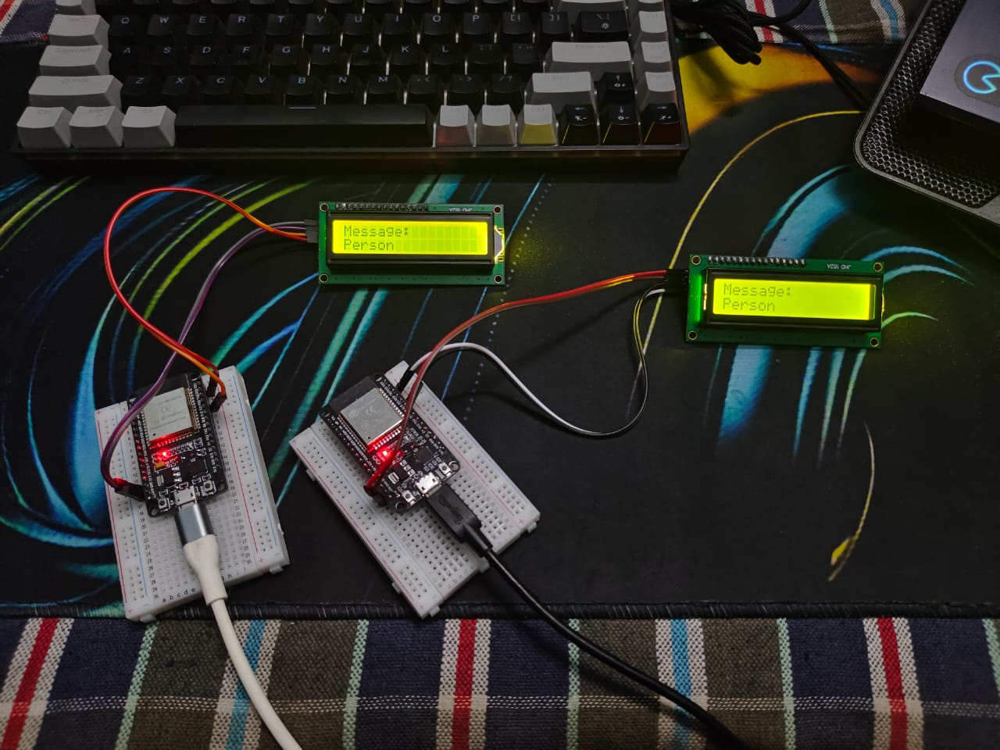
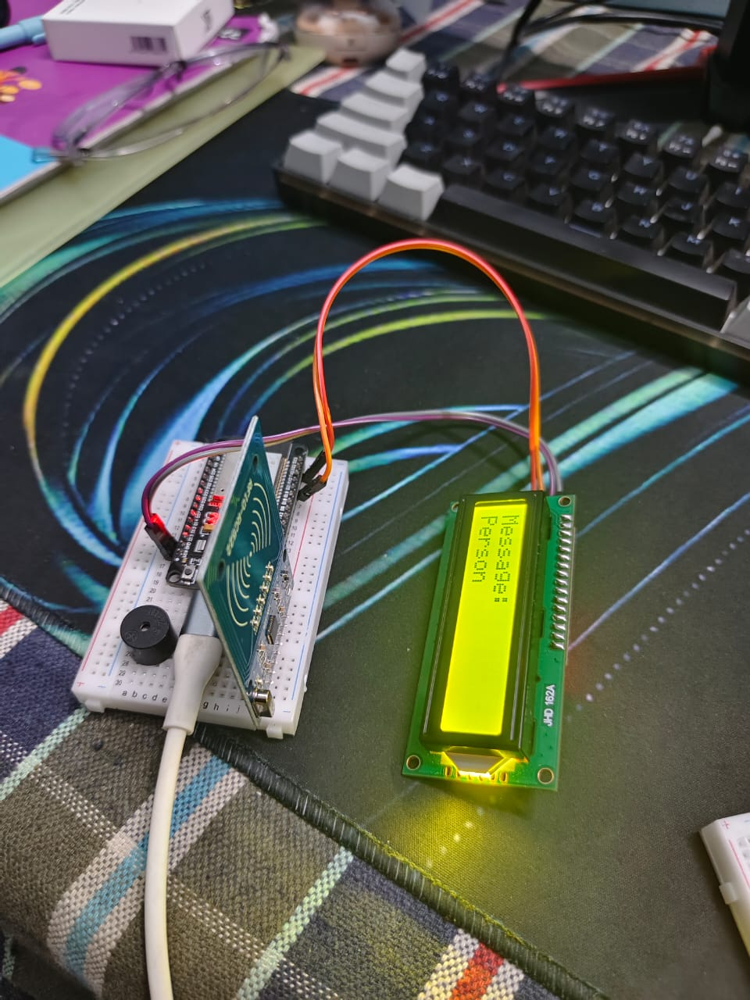

# Safe_Env


# AI-Powered Real-Time Road Hazard Detection & Vehicle-to-Vehicle (V2V) Alert System

🚗 **Enhancing urban road safety through AI-driven hazard detection and smart communication** 🚦

---

## 📖 Table of Contents

- [Features](#features)
- [Architecture](#architecture)
- [Getting Started](#getting-started)
- [Usage](#usage)
- [Dependencies](#dependencies)
- [Contributing](#contributing)
- [Demo](#demo)
- [Acknowledgments](#acknowledgments)

---

## ✅ Features

### 🔍 Real-Time Hazard Detection
- Detects **potholes, accidents, obstructions, weather risks,** and **traffic congestion** using AI models (**YOLOv8, CNN**).
- Dual data sources: **Vehicle-mounted cameras** and **traffic cameras**.

### 🚗 Vehicle-to-Vehicle (V2V) Communication
- Broadcasts hazard alerts to nearby vehicles via **DSRC/5G**.
- **OpenXC** or **Car-to-X protocols** for seamless integration.

### 📢 Roadside Viewboard Integration
- Displays **real-time hazard warnings** on **IoT-enabled boards** at high-risk locations.

### 🚑 Emergency Vehicle Priority
- Alerts **traffic inspectors** and **drivers** of approaching emergency vehicles.
- Sends **precise accident coordinates** to **emergency services** via APIs.

### ⚠️ Collision Risk Mitigation
- Analyzes **traffic camera feeds** at junctions to **prevent collisions**.

---

## 🏗️ Architecture

### 🔹 System Overview

#### 1️⃣ **Data Collection**
- **Cameras (vehicle-mounted & traffic)** stream video to edge devices.

#### 2️⃣ **AI Processing**
- Pre-trained models (e.g., **YOLOv8**) run on **Raspberry Pi/Arduino** for real-time inference.

#### 3️⃣ **V2V Communication**
- Hazards are broadcast to nearby vehicles via **Dedicated Short-Range Communication (DSRC)**.

#### 4️⃣ **Viewboard Display**
- Alerts are pushed to **IoT boards** using **MQTT/HTTP**.

#### 5️⃣ **Emergency Response**
- Accident coordinates sent to **emergency APIs** (e.g., Firebase, AWS IoT).

---

## 🚀 Getting Started

### 🔧 Prerequisites

Ensure you have the following:
- **Python 3.8+**
- **Raspberry Pi 4** or a similar edge device
- **Vehicle-mounted cameras** (e.g., Raspberry Pi Camera Module)
- **Traffic cameras** (IP cameras supported)

### 📥 Setup

#### 1️⃣ **Clone the repository**
```bash
git clone https://github.com/your-username/Safe_Env.git
```

#### 2️⃣ **Install dependencies**
```bash
pip install -r requirements.txt
```

#### 3️⃣ **Configure hardware**
- Connect cameras and set up **camera feeds** in `config/camera_config.yaml`.
- Configure **V2V communication settings** in `config/v2v_config.json`.

#### 4️⃣ **Run the system**
```bash
# Start AI inference (vehicle-mounted)
python src/vehicle_ai.py

# Start traffic camera monitoring
python src/traffic_monitor.py

# Run V2V communication server
python src/v2v_server.py
```

---

## 🔧 Usage

### 🎥 **Hazard Detection**
- AI module **processes video feeds** and identifies hazards in real-time.

### 📡 **Alert Distribution**
- V2V alerts are sent to nearby vehicles.
- IoT viewboards update with real-time hazard data.

### 🚑 **Emergency Response**
- Accidents **trigger automatic alerts** to emergency services.

---

## 📦 Dependencies

| Package | Function |
|---------|----------|
| `tensorflow-lite` | On-device AI inference |
| `opencv-python` | Video feed processing |
| `paho-mqtt` | IoT communication for viewboards |
| `flask` | REST API for emergency services |

---

## 🤝 Contributing

We welcome contributions! Follow these steps:

1. **Fork** the repo.
2. **Create a branch**:
   ```bash
   git checkout -b feature/<your-feature>
   ```
3. **Implement changes & test**.
4. **Submit a PR** with clear documentation.

### Areas to Contribute:
- Optimize **AI model efficiency**.
- Improve **V2V communication protocols**.
- Enhance **viewboard IoT integration**.

---

## 🎥 Demo

### 📹 **Demo Video**
<video width="600" controls>
  <source src="assets/demovid.mp4" type="video/mp4">
  Your browser does not support the video tag.
</video>

### 🖼️ **Project Images**



---

## 🙌 Acknowledgments

- Open-source tools: **TensorFlow Lite, OpenCV, MQTT**
- Inspired by **NHTSA safety guidelines** & **IEEE smart city research**.

---

🚀 **Safe_Env**: Making roads safer through **AI & smart communication**! 🚗💡

